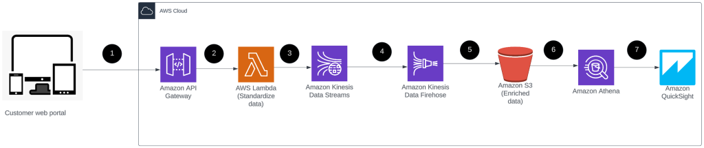

Detalhes do Serviço
-------------------

A solução desenvolvida utiliza diversos serviços da AWS para captura, processamento, armazenamento, análise e visualização de dados de clickstream de forma eficiente e escalável. Os principais serviços incluídos são:

*   **Amazon API Gateway**: Utilizado para receber e gerenciar as requisições de clickstream dos clientes.
*   **AWS Lambda**: Responsável pelo processamento em tempo real das requisições recebidas pelo API Gateway.
*   **Amazon Kinesis Data Streams**: Utilizado para ingestão contínua e processamento de grandes volumes de dados de clickstream em tempo real.
*   **Amazon Kinesis Data Firehose**: Utilizado para salvar os dados brutos no Amazon S3 de forma automatizada e escalável.
*   **Amazon Simple Storage Service (Amazon S3)**: Armazena os dados brutos de clickstream de forma durável e acessível.
*   **Amazon Athena**: Utilizado para consultar e analisar os dados armazenados no Amazon S3 de maneira eficiente e econômica.
*   **Amazon QuickSight**: Utilizado para visualizar e criar dashboards interativos com os insights obtidos a partir dos dados analisados.

Diagrama de Arquitetura de Referência
-------------------------------------

Casos de Uso
------------

A solução atende a diversos casos de uso, incluindo:

*   Captura e processamento em tempo real de dados de clickstream.
*   Armazenamento seguro e durável de dados brutos no Amazon S3.
*   Análise e consulta eficiente dos dados armazenados usando o Amazon Athena.
*   Visualização de insights e tendências por meio de dashboards interativos no Amazon QuickSight.

Proposta de Valor da AWS
------------------------

A utilização dos serviços da AWS proporciona diversas vantagens, tais como:

*   Escalabilidade automática e sob demanda dos recursos, sem a necessidade de provisionamento manual de servidores.
*   Alta disponibilidade e durabilidade dos dados armazenados no Amazon S3.
*   Preços competitivos e modelo de pagamento conforme o uso dos serviços.
*   Integração simplificada entre os serviços da AWS, proporcionando uma solução coesa e eficiente.

Características e Perfis dos Clientes-Alvo
------------------------------------------

A solução é direcionada para empresas de e-commerce que desejam melhorar a compreensão do comportamento do usuário em suas plataformas. Os clientes-alvo incluem:

*   Empresas que não possuem métricas claras do comportamento do usuário e desejam obter insights valiosos para otimizar a experiência do cliente.
*   Empresas que já tentaram soluções de tracking, mas encontraram dificuldades devido a licenciamento oneroso ou fardo operacional elevado.
*   Empresas que possuem plataformas de Business Intelligence, mas enfrentam desafios para integrar e analisar dados de clickstream.

Mecanismos de Envolvimento e Entrega do Cliente
-----------------------------------------------

Os clientes podem se envolver e se beneficiar da solução de várias maneiras:

*   Implantação e configuração simplificadas por meio de modelos de infraestrutura como código (IaC).
*   Personalização da solução de acordo com as necessidades específicas de cada cliente.
*   Suporte técnico especializado fornecido pela equipe de arquitetura de soluções da AWS para garantir o sucesso da implementação.